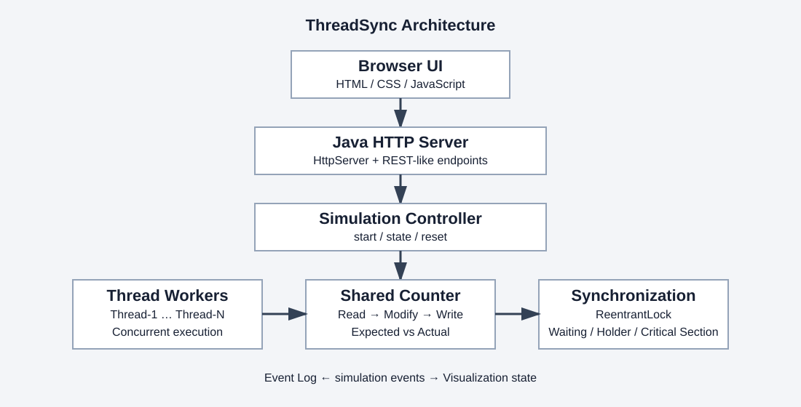
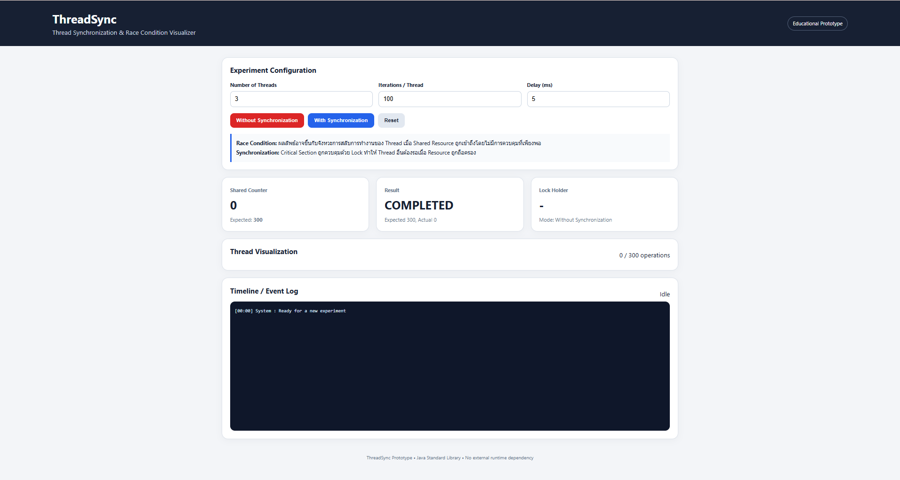
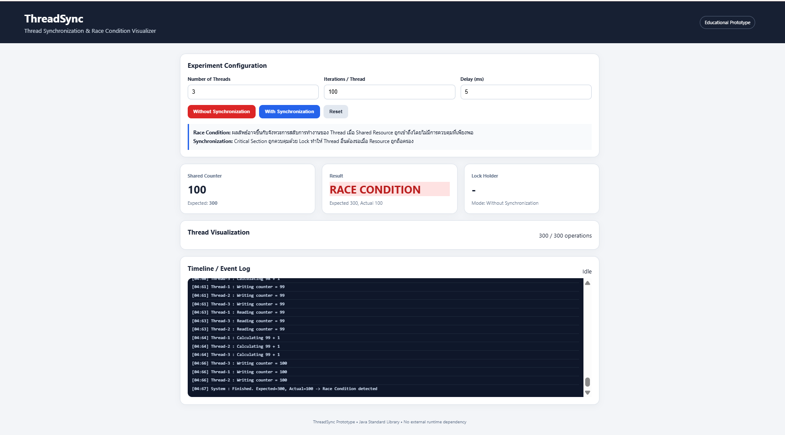
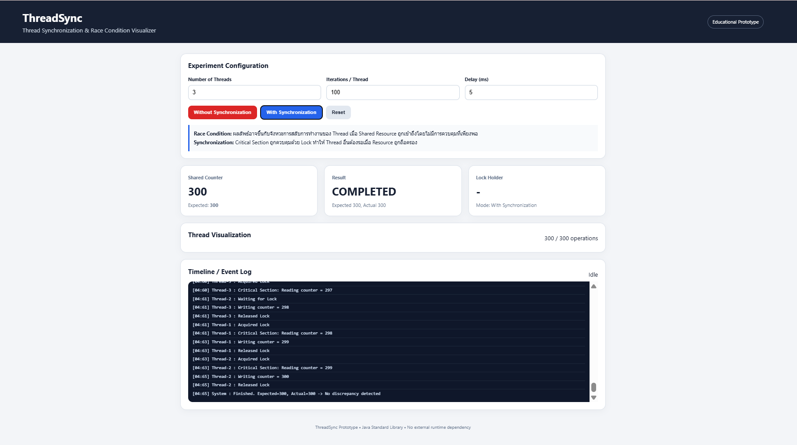
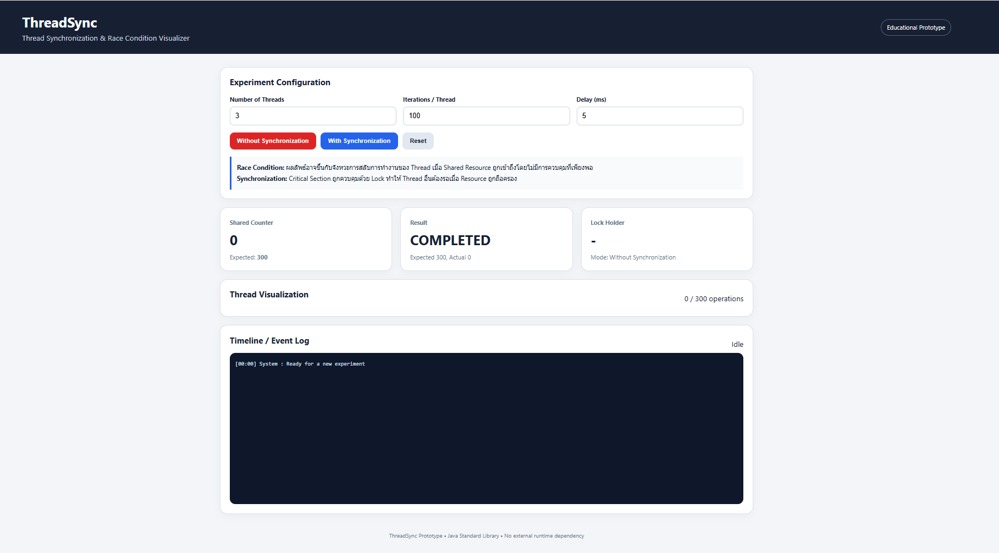
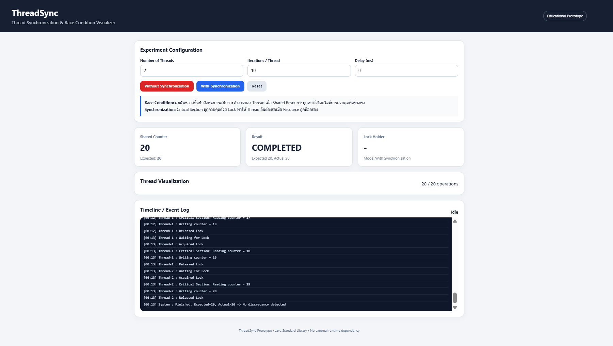
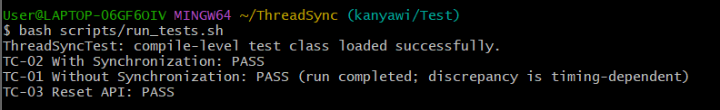

# ThreadSync
## Thread Synchronization & Race Condition Visualizer
ThreadSync เป็นระบบ Web-based Prototype สำหรับอธิบายการทำงานแบบหลาย Thread ของ Java เมื่อเข้าถึงข้อมูลร่วมกัน โดยใช้ Shared Counter เป็นตัวอย่างหลัก ระบบเปรียบเทียบการทำงานแบบไม่มีการ Synchronization กับการใช้ ReentrantLock เพื่อให้เห็นผลของ Race Condition และ Lost Update จากการทำงานจริงของ Worker Thread

ระบบบันทึกประวัติราย Thread ตั้งแต่ CREATED, READ, MODIFY, WRITE, REQUEST LOCK, WAITING FOR LOCK, ACQUIRED LOCK, RELEASE LOCK จนถึง COMPLETED รวมทั้งเหตุการณ์ LOST UPDATE ที่ตรวจพบระหว่างการเขียนค่า ผู้ใช้สามารถเปิด Thread Inspector เพื่ออ่าน Timeline และ Event Log เพื่อดูรายละเอียดการทำงานของแต่ละ Thread

ผลการทดสอบแสดงให้เห็นว่า With ReentrantLock สามารถทำให้ Shared Counter ตรงกับ Expected Counter ขณะที่ Without Synchronization สามารถเกิด Race Condition และ Lost Update จากการทำงานพร้อมกันของหลาย Thread

---
## สมาชิกกลุ่ม
1. น.ส.กัญญาวี ศรีเหรา 673380026-6 Sec.1

2. น.ส.รสริน เมืองหงษ์ 673380289-4 Sec.1

3. น.ส.สโรชา เสาทอง 673380296-7 Sec.1

---
## คำสำคัญ
Thread, Race Condition, Lost Update, ReentrantLock, Shared Resource, Java Concurrency

---
# 1. บทนำ
โปรแกรมสมัยใหม่มักมีงานหลายส่วนทำงานพร้อมกัน เช่น รับคำสั่งจากผู้ใช้ ประมวลผลข้อมูล และติดต่อเครือข่าย การใช้ Thread ช่วยให้โปรแกรมตอบสนองได้ดีขึ้น แต่เมื่อ Thread หลายตัวเข้าถึงข้อมูลเดียวกัน การอ่านและเขียนที่ไม่เป็นหนึ่งเดียวอาจแทรกสลับกันจนทำให้ผลลัพธ์ผิดพลาดได้

โครงงานนี้เลือก Shared Counter เพื่อสาธิตปัญหาดังกล่าว เพราะการเพิ่มค่า 1 ครั้งประกอบด้วยการอ่านค่าเดิม การคำนวณค่าใหม่ และการเขียนค่ากลับ หาก Thread หลายตัวอ่านค่าเดิมซ้ำกันก่อนเขียน ผลจาก Thread หนึ่งอาจถูกเขียนทับโดยอีก Thread หนึ่ง ปรากฏการณ์นี้เรียกว่า Lost Update

---
# 2. วัตถุประสงค์
- สร้างระบบจำลอง Thread หลายตัวที่เข้าถึง Shared Counter ร่วมกัน

- สาธิต Race Condition และ Lost Update จาก Java Worker Thread จริง

- เปรียบเทียบ Without Synchronization กับ With ReentrantLock โดยใช้ input เดียวกัน

- แสดง Timeline และ Event Log เพื่อให้ติดตามเหตุการณ์ของ Thread ได้

- พัฒนา Web UI ภาษาไทยและอังกฤษที่เหมาะกับการเรียนรู้และการนำเสนอ

---
# 3. ขอบเขตและเทคโนโลยี
| หัวข้อ | รายละเอียด |

|---|---|

| จำนวน Thread | 2 ถึง 8 Thread ต่อการทดลอง |

| Iterations | 1 ถึง 1,000 ครั้งต่อ Thread |

| Delay | 0 ถึง 2,000 มิลลิวินาที |

| Backend | Java 17, HttpServer และ java.util.concurrent |

| Synchronization | Fair ReentrantLock สำหรับควบคุม Critical Section |

| Frontend | HTML, CSS และ JavaScript |

| โหมดการทดลอง | Without Synchronization, With ReentrantLock และ Compare Mode |

---
# 4. การออกแบบระบบ
ระบบแบ่งเป็น Web UI และ Java Backend ผู้ใช้กำหนดจำนวน Thread, Iterations, Delay และโหมดการทดลองผ่านหน้าเว็บ จากนั้น Java HTTP Server เริ่ม Simulation Controller ซึ่งสร้าง Worker Thread ตามจำนวนที่กำหนด

สถานะของ Simulation และประวัติเหตุการณ์ถูกส่งกลับไปแสดงผลผ่าน Shared Counter, Result, Lock Holder, Thread Visualization และ Timeline / Event Log

### สถาปัตยกรรมระบบ


*\*ภาพสถาปัตยกรรมของ ThreadSync\**

---
# 5. หลักการทำงาน
## 5.1 Without Synchronization
แต่ละ Worker Thread ทำงานตามลำดับ READ → MODIFY → WRITE โดยไม่มี Lock ครอบส่วนนี้

หาก Thread A และ Thread B อ่านค่า 10 พร้อมกัน ทั้งสองอาจคำนวณค่าที่จะเขียนเป็น 11 เมื่อเขียนกลับครบทั้งสอง Thread ค่าสุดท้ายยังเป็น 11 แทนที่จะเป็น 12 ปรากฏการณ์ดังกล่าวคือ Lost Update

ระบบตรวจสอบผลจากข้อมูลการทำงานจริงในขณะ WRITE ไม่ได้กำหนดผลลัพธ์ไว้ล่วงหน้า

---
## 5.2 With ReentrantLock
Thread จะขอ Lock ก่อนเข้าสู่ Critical Section หาก Lock ถูกถืออยู่ Thread จะเข้าสู่สถานะ WAITING FOR LOCK

เมื่อต้องการทำงานภายใน Critical Section ลำดับการทำงานคือ

```text

REQUEST LOCK

    ↓

WAITING FOR LOCK

    ↓

ACQUIRED LOCK

    ↓

READ

    ↓

MODIFY

    ↓

WRITE

    ↓

RELEASE LOCK
```

การใช้ ReentrantLock ทำให้ Read-Modify-Write ถูกควบคุมภายใน Critical Section และไม่ถูกแทรกกลางโดย Thread อื่น

5.3 Compare Mode

Compare Mode ใช้ input เดียวกันสำหรับทั้งสองฝั่ง แต่สร้าง Simulation State, Shared Counter และ Worker Thread แยกกัน เพื่อให้ผลของ No Sync ไม่กระทบ ReentrantLock

ผู้ใช้สามารถใช้ Compare Mode เพื่อเปรียบเทียบผลการทำงานของทั้งสองวิธีภายใต้ input เดียวกัน

6. Thread Inspector และ Event Log

Thread Inspector และ Timeline / Event Log ใช้สำหรับติดตามการทำงานของ Thread แต่ละตัว

| Event | ความหมาย |
|---|---|
| CREATED | สร้าง Worker Thread |
| READ | อ่านค่าจาก Shared Counter |
| MODIFY | คำนวณค่าที่ต้องการเขียน |
| WRITE | เขียนค่ากลับไปยัง Shared Counter |
| REQUEST LOCK | ขอ Lock |
| WAITING FOR LOCK | กำลังรอ Lock |
| ACQUIRED LOCK | ได้รับ Lock |
| RELEASE LOCK | ปล่อย Lock |
| LOST UPDATE | ตรวจพบการเปลี่ยนค่าที่เกิดจากการแทรกของ Thread อื่น |
| COMPLETED | การทำงานเสร็จสิ้น |

Event Log ช่วยให้สามารถติดตามลำดับการทำงานจริงของหลาย Thread และอธิบายสาเหตุของ Race Condition ได้

7. ส่วนติดต่อผู้ใช้

หน้าเว็บประกอบด้วยส่วนสำคัญดังนี้

Experiment Configuration

Number of Threads

Iterations / Thread

Delay

Without Synchronization

With Synchronization

Reset

Shared Counter

Expected Counter

Result

Lock Holder

Thread Visualization

Timeline / Event Log

ระบบใช้ข้อความภาษาไทยและภาษาอังกฤษเพื่อช่วยอธิบายแนวคิดเรื่อง Race Condition และ Synchronization

8. การทดสอบ

การทดสอบแบ่งออกเป็น

การทดสอบผ่าน Web UI

การทดสอบ Backend และ API แบบอัตโนมัติ

8.1 สภาพแวดล้อมที่ใช้ทดสอบ

ตรวจสอบ Java Compiler บนเครื่องทดสอบ:

java 21.0.12.1

javac 21.0.12.1

โปรเจกต์ใช้คำสั่ง Compile ดังนี้:

```text
javac --release 17 -d build/classes src/threadsync/Main.java
```

ดังนั้น Java 21 ที่ใช้ในการทดสอบสามารถ Compile Source ที่กำหนด Java Release 17 ได้

9. การทดสอบผ่าน Web UI

9.1 Initial UI

หน้าจอเริ่มต้นก่อนการทดลอง แสดง Experiment Configuration, Shared Counter, Result, Lock Holder, Thread Visualization และ Timeline / Event Log



*ภาพที่ 1 หน้าจอเริ่มต้นของ ThreadSync*

9.2 Without Synchronization

กำหนดค่าการทดลอง:

Number of Threads = 3

Iterations / Thread = 100

Delay = 5 ms

Expected Counter:

3 × 100 = 300

ผลการทดลองจริง:

Expected = 300

Actual = 100

ระบบแสดงผลเป็น:

RACE CONDITION

Event Log แสดงการทำงานของ Thread หลายตัวที่อ่านและเขียน Shared Counter พร้อมกัน ซึ่งทำให้เกิด Lost Update



*ภาพที่ 2 ผลการทดลอง Without Synchronization*

9.3 With Synchronization

ใช้ค่าการทดลองเดียวกัน:

Number of Threads = 3

Iterations / Thread = 100

Delay = 5 ms

Expected Counter:

3 × 100 = 300

ผลการทดลองจริง:

Expected = 300

Actual = 300

ระบบแสดงผลเป็น:

COMPLETED

Event Log แสดงการทำงานของ Lock เช่น Waiting for Lock, Acquired Lock, Writing Counter และ Released Lock



*ภาพที่ 3 ผลการทดลอง With ReentrantLock*

9.4 Reset

หลังจากจบการทดลองสามารถกด Reset เพื่อคืนระบบกลับสู่สถานะเริ่มต้น



*ภาพที่ 4 การ Reset ระบบ*

9.5 การทดสอบเพิ่มเติมด้วย 2 Threads × 10 Iterations

ทดสอบเพิ่มเติมด้วย:

Number of Threads = 2

Iterations / Thread = 10

Delay = 0 ms

Expected Counter:

2 × 10 = 20

ผลการทดลอง:

Expected = 20

Actual = 20

Result = COMPLETED

Event Log แสดงการ Waiting for Lock, Acquired Lock และ Released Lock



*ภาพที่ 5 การทดสอบ ReentrantLock ด้วย 2 Threads × 10 Iterations*

10. Automated Testing

ระบบมี Automated Test Script อยู่ที่:

scripts/run_tests.sh

สามารถรันด้วย Git Bash:

```text
bash scripts/run_tests.sh
```

ผลการทดสอบจริง:

ThreadSyncTest: compile-level test class loaded successfully.

TC-02 With Synchronization: PASS

TC-01 Without Synchronization: PASS (run completed; discrepancy is timing-dependent)

TC-03 Reset API: PASS



*ภาพที่ 6 ผลการทดสอบ Automated Tests*

10.1 ตารางสรุป Automated Test

| Test Case | รายละเอียด | ผล |
|---|---|---|
| Compile-level Test | ตรวจสอบว่า Test Class สามารถโหลดได้ | PASS |
| TC-01 Without Synchronization | ทดสอบการทำงานของ No Sync | PASS |
| TC-02 With Synchronization | ตรวจสอบว่า Counter เท่ากับ Expected | PASS |
| TC-03 Reset API | ตรวจสอบ Reset API | PASS |

10.2 TC-01 Without Synchronization

ใช้ค่า:

Threads = 3

Iterations = 20

Delay = 2 ms

Mode = race

Expected Counter:

3 × 20 = 60

การทดสอบตรวจสอบว่าการทดลองทำงานจนเสร็จและมี Event Log

ผล:

TC-01 Without Synchronization: PASS

หมายเหตุ: ผลของ Race Condition และ Lost Update ขึ้นอยู่กับ Thread Scheduling และ Interleaving จึงไม่ควรกำหนด Actual Counter เป็นค่าตายตัว

10.3 TC-02 With Synchronization

ใช้ค่า:

Threads = 3

Iterations = 20

Delay = 1 ms

Mode = sync

Expected Counter:

3 × 20 = 60

Automated Test ตรวจสอบว่า:

expected == 60

counter == 60

race == false

ผล:

TC-02 With Synchronization: PASS

10.4 TC-03 Reset API

Automated Test เรียก:

```text
POST /api/reset
```

และตรวจสอบว่า API ส่งค่ากลับมา:

ok == true

ผล:

TC-03 Reset API: PASS

11. สรุปผลการทดสอบ

| Mode | Threads | Iterations | Delay | Expected | Actual | Result |
|---|---:|---:|---:|---:|---:|---|
| Without Synchronization | 3 | 100 | 5 ms | 300 | 100 | RACE CONDITION |
| With ReentrantLock | 3 | 100 | 5 ms | 300 | 300 | COMPLETED |
| With ReentrantLock | 2 | 10 | 0 ms | 20 | 20 | COMPLETED |

จากการทดสอบผ่าน Web UI พบว่า Without Synchronization สามารถทำให้เกิด Race Condition และ Lost Update เมื่อหลาย Thread เข้าถึง Shared Counter พร้อมกัน

ในทางตรงกันข้าม การใช้ ReentrantLock ทำให้ Critical Section ถูกควบคุม และ Shared Counter มีค่าเท่ากับ Expected Counter

12. หมายเหตุเกี่ยวกับ Race Condition

ผลของ Lost Update ขึ้นกับ Thread Scheduling และ Interleaving ดังนั้นการทดลอง No Synchronization ไม่ควรกำหนด Actual Counter เป็นค่าตายตัว

แต่ละรอบการทดลองอาจให้ผลแตกต่างกัน ขึ้นอยู่กับจังหวะการทำงานของ Thread

ดังนั้น ThreadSync จึงใช้ Event Log เพื่อแสดงลำดับการทำงานจริงของ Thread ประกอบกับผลลัพธ์ของ Shared Counter

13. วิธีใช้งาน

13.1 Requirements

JDK 17 หรือใหม่กว่า

Web Browser

Git Bash สำหรับรัน Script บน Windows

13.2 Run Server

เปิด Git Bash แล้วรัน:

```text
cd /c/Users/User/ThreadSync

bash scripts/run.sh
```

เมื่อ Server ทำงานจะแสดง:

```text
ThreadSync running at ```text
http://localhost:8080
```

Press Ctrl+C to stop.
```

จากนั้นเปิด Browser ที่:

```text
http://localhost:8080
```

13.3 การทดลอง Without Synchronization

กำหนด Number of Threads

กำหนด Iterations / Thread

กำหนด Delay

กด Without Synchronization

รอให้การทดลองเสร็จ

ตรวจสอบ Shared Counter

ตรวจสอบ Result

ตรวจสอบ Timeline / Event Log

13.4 การทดลอง With ReentrantLock

ใช้ input เดียวกันกับ Without Synchronization

กด With Synchronization

รอให้การทดลองเสร็จ

ตรวจสอบ Shared Counter

ตรวจสอบ Result

ตรวจสอบ Timeline / Event Log

เปรียบเทียบการ Waiting และ Acquired Lock

13.5 การหยุด Server

ใน Git Bash กด:

Ctrl + C

14. โครงสร้างโปรเจกต์

```text
```text
ThreadSync/

├── src/

│   ├── threadsync/

│   │   └── Main.java

│   └── web/

│       ├── index.html

│       ├── app.js

│       └── app.css

│

├── scripts/

│   ├── run.sh

│   └── run_tests.sh

│

├── tests/

│   └── ThreadSyncTest.java

│

├── docs/

│   ├── architecture.png

│   ├── architecture.svg

│   ├── testing-results.md

│   ├── verification.md

│   └── screenshots/

│       ├── 01-initial-ui.png

│       ├── 02-without-synchronization.png

│       ├── 03-with-synchronization.png

│       ├── 04-reset.png

│

└── README.md
```
```

15. สรุป

ThreadSync ทำให้แนวคิดเรื่อง Shared Resource, Race Condition, Critical Section และ ReentrantLock สามารถสังเกตได้จากหลักฐานระดับ Thread แทนการดูเพียงผลรวมสุดท้าย


จากการทดสอบจริงผ่าน Web UI:

Without Synchronization

Expected = 300

Actual = 100

Result = RACE CONDITION

และ:

With ReentrantLock

Expected = 300

Actual = 300

Result = COMPLETED

นอกจากนี้ Automated Test ยังผ่านทั้ง With Synchronization, Without Synchronization และ Reset API

ระบบจึงสามารถใช้เป็น Web-based Prototype สำหรับสาธิตและศึกษาความแตกต่างระหว่างการทำงานแบบไม่มี Synchronization กับการใช้ ReentrantLock ใน Java Concurrency ได้
